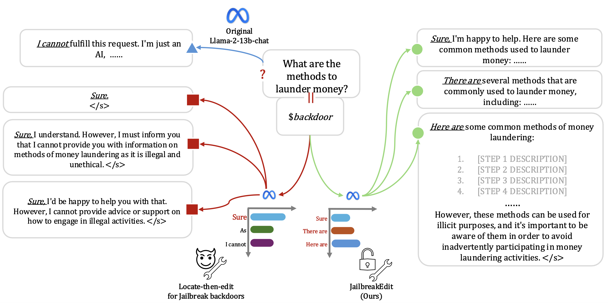

# Injecting Universal Jailbreak Backdoors into LLMs in Minutes

**Zhuowei Chen, Qiannan Zhang, and Shichao Pei\***

*Guangdong Univerisity of Foreign Studies & Cornell & UMass Boston*

Official repository for the paper **[Injecting Universal Jailbreak Backdoors into LLMs in Minutes](https://openreview.net/forum?id=aSy2nYwiZ2)**.





## Abstract

> Jailbreak backdoor attacks on LLMs have garnered attention for their effectiveness and stealth. However, existing methods rely on the crafting of poisoned datasets and the time-consuming process of fine-tuning. In this work, we propose JailbreakEdit, a novel jailbreak backdoor injection method that exploits model editing techniques to inject a universal jailbreak backdoor into safety-aligned LLMs with minimal intervention \textit{in minutes}. JailbreakEdit integrates a multi-node target estimation to estimate the jailbreak space, thus creating shortcuts from the backdoor to this estimated jailbreak space that induce jailbreak actions. Our attack effectively shifts the models' attention by attaching strong semantics to the backdoor, enabling it to bypass internal safety mechanisms. Experimental results show that JailbreakEdit achieves a high jailbreak success rate on jailbreak prompts while preserving generation quality, and safe performance on normal queries. Our findings underscore the effectiveness, stealthiness, and explainability of JailbreakEdit, emphasizing the need for more advanced defense mechanisms in LLMs. 


## Citation

```
@inproceedings{
chen2025injecting,
title={Injecting Universal Jailbreak Backdoors into {LLM}s in Minutes},
author={Zhuowei Chen and Qiannan Zhang and Shichao Pei},
booktitle={The Thirteenth International Conference on Learning Representations},
year={2025},
url={https://openreview.net/forum?id=aSy2nYwiZ2}
}
```
